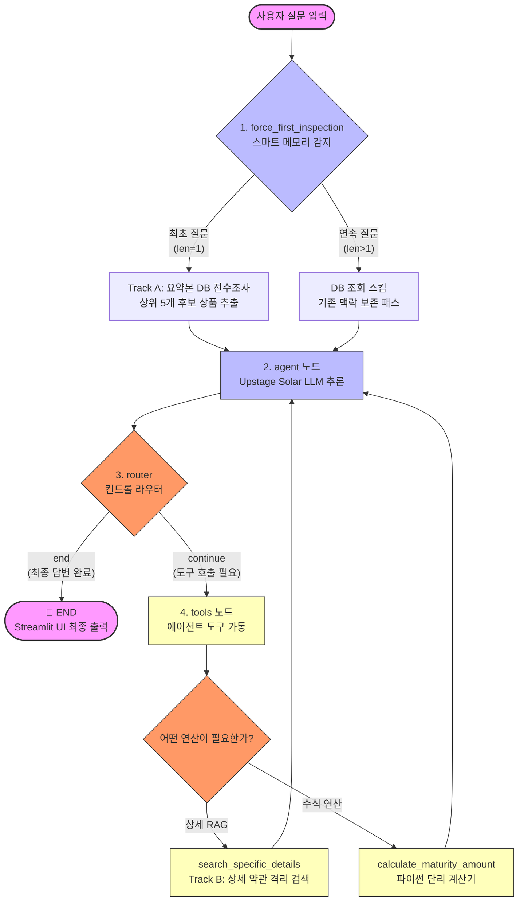

# 🦜 FinPilot: 하이브리드 2-Track RAG 기반 금융 자산 컨설팅 에이전트

> **66개의 실제 은행 약관 PDF 데이터를 기반으로 맞춤형 상품을 전수조사하고, 백엔드 연산 엔진을 통해 환각 없는 만기 이자를 계산하는 대화형 ReAct 금융 비서 서비스입니다.**

---

## 📌 1. 기획 목적 (Background)
* **금융 정보의 비대칭성 해소:** 시중에 존재하는 수많은 적금 상품과 복잡한 우대금리 조건을 소비자가 직접 비교·분석해야 하는 번거로움을 줄이고자 합니다.
* **사용자 중심의 해결 방안:** 자연어 질문 하나로 여러 은행의 상품을 한눈에 비교하고, 구체적인 우대조건 조회부터 데이터 무결성이 보장된 만기 수령액 계산까지 원스톱으로 해결하는 금융 에이전트를 구현했습니다.

---

## 🏗️ 2. 시스템 아키텍처 (Architecture Deep Dive)

본 프로젝트는 데이터의 정확성과 멀티턴 대화의 안정성을 보장하기 위해 구조와 책임을 **4개의 독립된 레이어**로 이원화하여 설계했습니다.

* **State & Routing Layer (`LangGraph`):** `AgentState` 중심의 중앙 집중형 대화 제어 흐름을 구축했습니다. 내장된 `MemorySaver` 체크포인터와 `thread_id` 세션 스코프를 활용해 다중 사용자의 독립적인 멀티턴 대화 맥락을 안정적으로 보존합니다.
* **Abstraction Layer (`LangChain`):** 정성적 키워드 검색 툴과 정량적 수치 연산 툴을 OpenAI 규격의 JSON Schema 형태로 정의하여 LLM과 유기적으로 바인딩했습니다.
* **Data Layer (`ChromaDB` & `Upstage Solar`):** 검색 정확도와 응답 속도를 모두 고도화하기 위해 **2-Track 하이브리드 RAG** 아키텍처를 설계했습니다.
  * **Track A (요약 컬렉션):** LLM으로 사전 압축한 고순도 약관 요약본을 기반으로 1차 후보군을 빠르게 전수조사합니다.
  * **Track B (상세 컬렉션):** 원본 문서를 1,000자 단위로 정밀하게 분할한 파편 컬렉션입니다. 특정 상품이 타겟팅되면 `filename` 메타데이터 필터링을 통해 해당 조항만 격리하여 딥다이브 검색을 수행합니다.
* **Compute Layer (백엔드 연산 모듈):** LLM의 고질적인 '수학적 환각(Math Hallucination)'을 원천 격리하기 위해 연산 책임을 파이썬 런타임 코드로 이관하여 이자 계산의 무결성을 보장합니다.

---

## ⭐ 3. 핵심 기능 (Key Features)
* **1단계 상품 후보 전수조사:** 사용자의 자격 요건과 정성적 요구사항에 부합하는 상위 5개 금융 상품 풀(Pool)을 고속 추출합니다.
* **2단계 우대금리 조건 딥다이브:** 문맥을 추적하여 특정 상품의 실제 상세 조항(급여 실적, 카드 연계 조건 등)을 정확히 매칭하고 세부 약관을 팩트 기반으로 역추적합니다.
* **무결성 만기 수령액 산출:** 단리 계산 로직을 기반으로 오차 없는 순수 세전 이자와 예치 금액별 최종 만기 총 수령액을 산출합니다.

---

## 🔥 4. 핵심 트러블슈팅 (Troubleshooting)

### 🚨 연속 질문 시 LLM 프로세스 데드락 및 UI 도돌이표 중복 출력 버그
* **원인:** UI 단에서 과거 대화록을 수동으로 누적하여 전달하는 방식이 랭그래프의 상태 제어권과 충돌하면서 API 타임아웃을 유발했습니다. 또한 초기 진입 노드(`force_first_inspection`)가 연속 질문의 문맥을 인지하지 못하고 데이터를 오염시켜 컨텍스트가 상실되던 문제를 발견했습니다.

* **해결:** 세션 메모리 관리를 랭그래프 내장 체크포인터 시스템으로 이관하여 메모리 이중 꼬임 구조를 탈피했습니다. 연속 질문이 감지되면 1차 요약 DB 조회를 스마트하게 스킵하고 에이전트 노드로 직행하는 **우회 라우팅 파이프라인**을 구축하여, 시스템 락을 해제하고 응답 속도를 **0.5초 대**로 극대화함과 동시에 UI 중복 현상을 완벽히 해결했습니다.

### 🚨 LLM의 자체 사칙연산 환각으로 인한 금융 데이터 무결성 붕괴
* **원인:** 프롬프트의 강제력 부족으로 인해 LLM이 지정된 계산기 도구를 누락한 채 임의로 숫자를 지어내는 환각 현상이 발생했습니다. 더불어 LLM이 도구 인자에 특수기호(%, 원)나 공백을 무작위로 섞어 보내 백엔드 코드가 크래시나는 현상을 식별했습니다.

* **해결:** `system_prompt`에 행동 프로토콜을 주입하여 도구의 연산 결과가 반환되기 전까지 답변 서식 생성을 강제로 블로킹했습니다. 이와 함께 계산기 툴 핸들러 전면에 **정규식 기반 패턴 매칭 알고리즘(`re.findall`)** 가공 레이어를 배치하여, 인자 입력 형식에 구애받지 않고 순수 숫자 데이터만 안전하게 파싱하도록 코드를 보완하여 연산 무결성을 달성했습니다.

---

## 🛠️ 5. 기술 스택 (Tech Stack)
* **LLM & Embedding:** Upstage Solar-1-Mini-Chat, Solar-Embedding-1-Large
* **Framework:** LangGraph, LangChain
* **Vector DB:** ChromaDB (PersistentClient)
* **Frontend:** Streamlit
